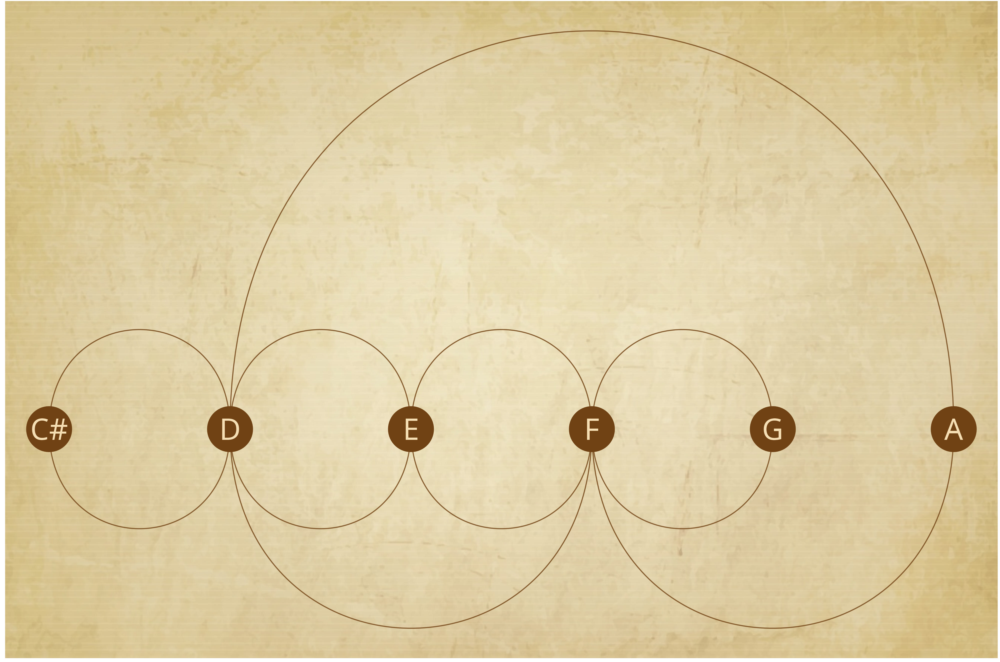
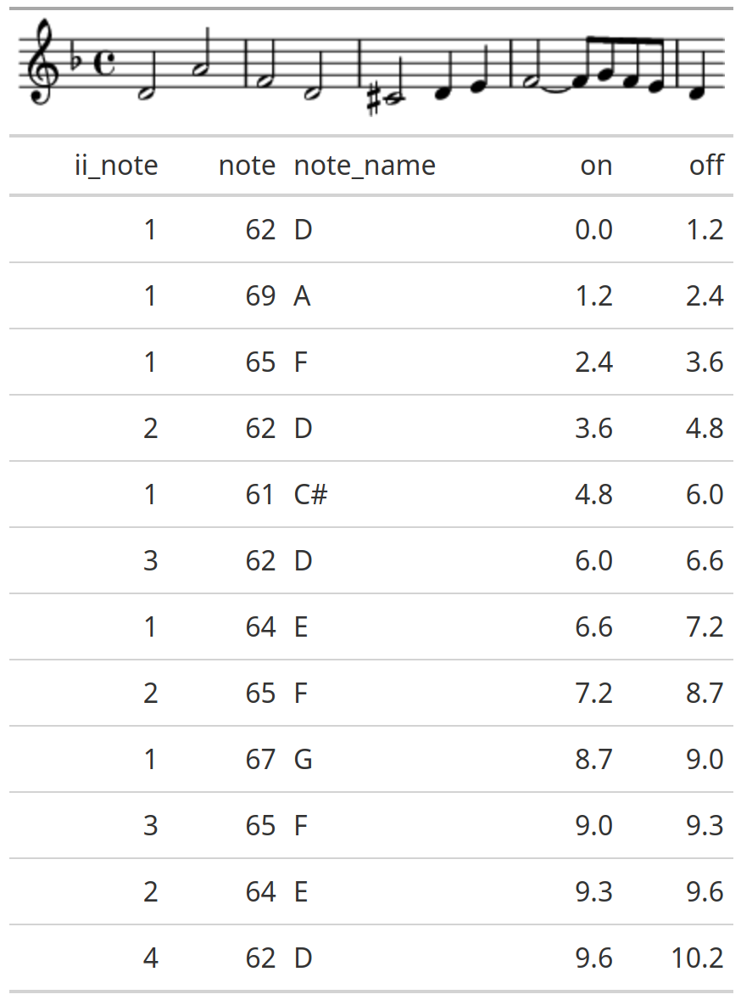
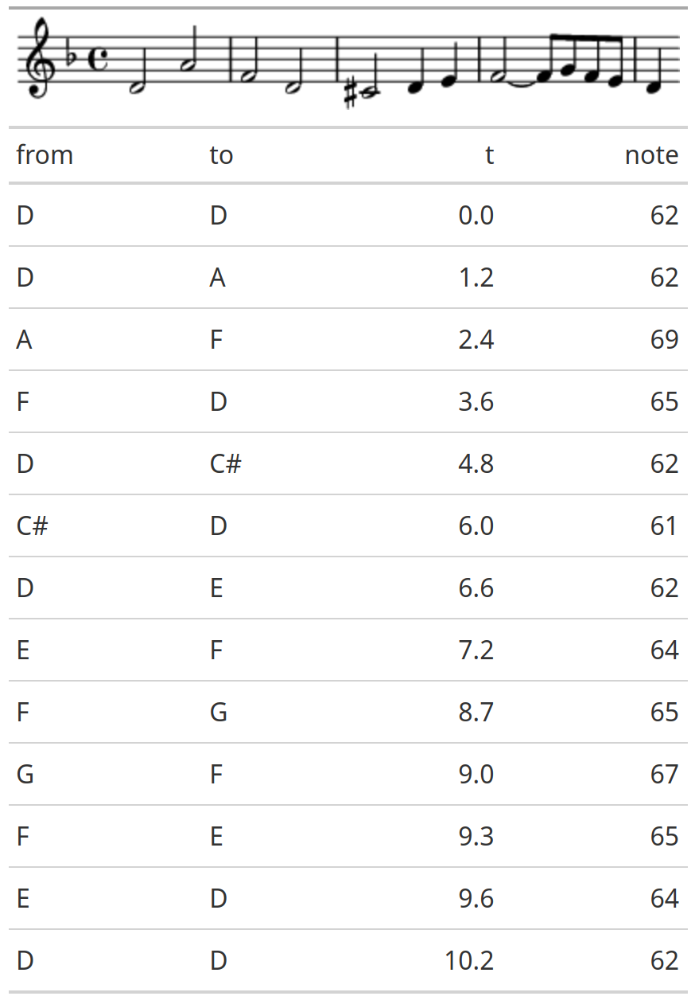

# digmus




An experimentation with animating a melody as a graph. 

[](http://www.youtube.com/watch?v=hmPNfeZ7w9k "Contrapunctus I Subject as Animated Graph")




## Unsolved problem

Including a self loop on the graph gets the timing right, however, the first edge is dropped. 



## Packages used

### r

```r
# key packages used 
library(pyramidi) # midi wrangling
library(tidygraph) # graph creation
library(ggraph) # graph plotting
library(gganimate) # animation
library(tidyverse) # r tools

# other packages
library(zealot)
library(gt)
library(jpeg)
library(grid)

```

### bash

```bash
ffmpeg
timidity

```

## Midi

[Raw midi file](https://github.com/softloud/digmus/tree/main/midi) sourced from wikipedia's page on [The Art of Fugue](https://en.wikipedia.org/wiki/The_Art_of_Fugue). 


## Code

See [step-by-step](https://github.com/softloud/digmus/tree/main/step-by-step) for each step of the process, from wranging midi, to plotting a graph, to animation. 

## Outputs 

Written to outputs/, but not all files are there as some of the intermediary files are too large to push to Git. 